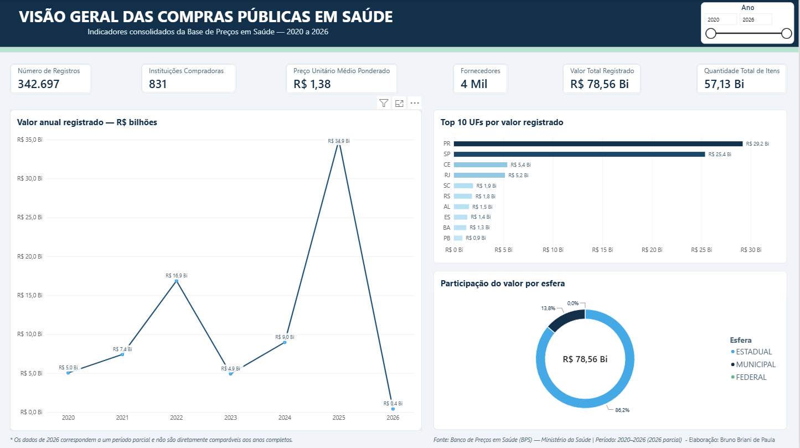
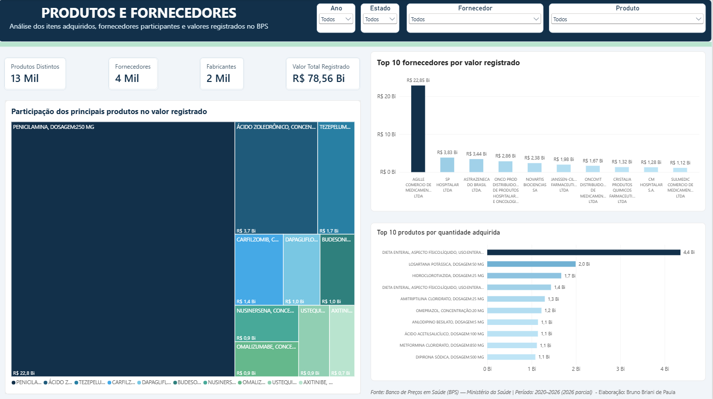
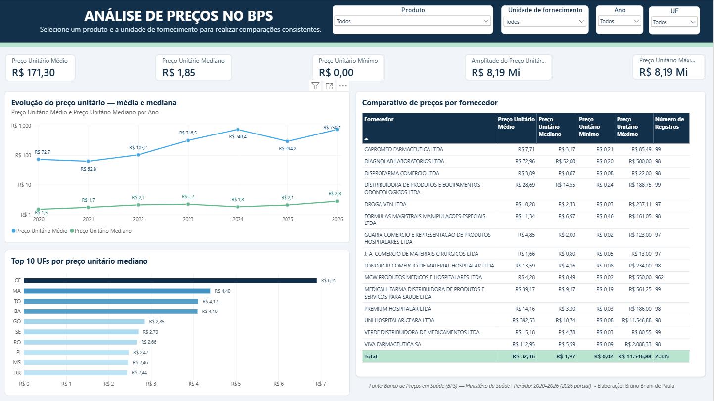
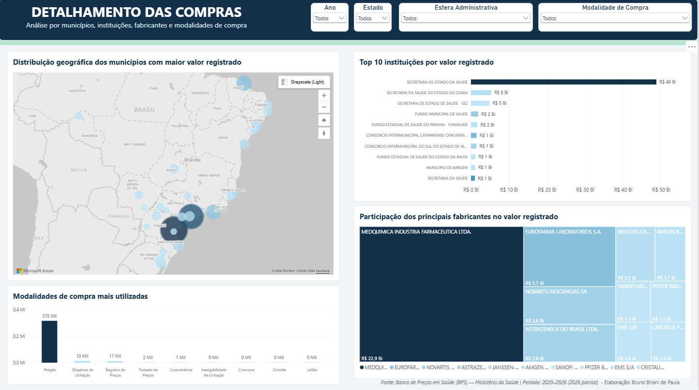

# Dashboard de Compras Públicas em Saúde — BPS 2020–2026

## Sobre o projeto

Este projeto apresenta um dashboard analítico desenvolvido no Power BI a partir dos dados públicos do Banco de Preços em Saúde (BPS), do Ministério da Saúde, abrangendo os anos de 2020 a 2026.

O objetivo é transformar os registros de compras de medicamentos, materiais hospitalares e dispositivos médicos em indicadores e visualizações que apoiem a exploração dos gastos, das quantidades adquiridas, dos compradores, dos fornecedores e das variações de preço.

> **Observação:** diferenças de preços não representam automaticamente economia, sobrepreço ou irregularidade. Fabricante, apresentação, unidade de fornecimento, quantidade, localidade, modalidade de compra, período e condições de negociação podem afetar os valores.

## Objetivos

- Consolidar os arquivos anuais do BPS em uma única base histórica.
- Avaliar a evolução dos valores registrados entre 2020 e 2026.
- Identificar estados, instituições, produtos e fornecedores com maior participação.
- Comparar média, mediana, mínimo e máximo dos preços unitários.
- Permitir análises interativas por produto, unidade, ano e UF.
- Evidenciar oportunidades para investigações mais detalhadas sobre diferenças de preços.

## Fonte dos dados

- **Fonte:** Banco de Preços em Saúde — BPS, Ministério da Saúde.
- **Portal:** [Portal de Dados Abertos do Ministério da Saúde](https://dadosabertos.saude.gov.br/dataset/bps)
- **Período:** 2020 a 2026.
- **Formato original:** sete arquivos CSV anuais.
- **Data de acesso:** setembro de 2026.

## Preparação e consolidação

A preparação foi realizada em Python com a biblioteca pandas. O script percorre os sete arquivos CSV da pasta `Dados Brutos`, aplica os tratamentos e concatena os registros em uma base histórica.

### Tratamentos realizados

- validação da presença dos sete arquivos anuais;
- conferência da estrutura de 25 colunas;
- leitura com delimitador `;` e codificação UTF-8;
- padronização de espaços em campos textuais;
- correção de caracteres e entidades HTML nas descrições CATMAT;
- remoção de tags HTML preservando seu conteúdo textual;
- conversão das datas de compra e inserção;
- conversão dos campos de quantidade e preço para tipos numéricos;
- preservação de CNPJs e códigos identificadores como texto;
- verificação da correspondência entre o ano do arquivo e `ano_compra`;
- identificação e remoção apenas de registros completamente duplicados;
- validação de `preco_total` em relação a quantidade × preço unitário.

### Resultado da consolidação

| Indicador | Resultado |
|---|---:|
| Registros antes da limpeza | 342.716 |
| Registros duplicados removidos | 19 |
| Registros finais | 342.697 |
| Colunas | 25 |
| Divergências financeiras identificadas | 0 |
| Registros com HTML remanescente em `descricao_catmat` | 0 |

Distribuição dos registros finais:

| Ano | Registros |
|---:|---:|
| 2020 | 84.819 |
| 2021 | 83.622 |
| 2022 | 88.991 |
| 2023 | 31.992 |
| 2024 | 26.242 |
| 2025 | 26.214 |
| 2026 | 817 |

O processamento gera localmente o arquivo `BPS_20_26_Bruno_Briani.csv`. Para disponibilização no GitHub, a base consolidada foi compactada como `BPS_20_26_Bruno_Briani.zip`, reduzindo o tamanho de aproximadamente 129,42 MB para 18,42 MB.

## Principais colunas

| Coluna | Descrição e uso |
|---|---|
| `ano_compra` | Ano de realização da compra |
| `compra` | Data da compra |
| `nome_instituicao` | Instituição compradora |
| `esfera` | Esfera administrativa da instituição |
| `municipio_instituicao` | Município da instituição |
| `uf` | Unidade da Federação da instituição |
| `codigo_br` | Código de identificação do item no CATMAT |
| `descricao_catmat` | Descrição do medicamento ou material |
| `unidade_fornecimento` | Unidade utilizada no fornecimento |
| `modalidade_compra` | Modalidade utilizada na aquisição |
| `fornecedor` | Nome do fornecedor |
| `fabricante` | Nome do fabricante |
| `qtd_itens_comprados` | Quantidade adquirida |
| `preco_unitario` | Preço unitário registrado |
| `preco_total` | Valor total registrado |

## Modelagem no Power BI

Foi utilizada uma tabela fato, `Fato_BPS`, relacionada a uma dimensão calendário. O relacionamento ativo entre a data de compra e a dimensão permite análises anuais e temporais. As medidas foram organizadas em uma tabela exclusiva denominada `Medidas`.

## KPIs

| KPI | Definição |
|---|---|
| Valor Total Registrado | Soma de `preco_total` no contexto dos filtros |
| Quantidade Total de Itens | Soma de `qtd_itens_comprados` |
| Número de Registros | Quantidade de registros após os filtros |
| Instituições Compradoras | Contagem distinta das instituições |
| Fornecedores | Contagem distinta dos fornecedores |
| Preço Unitário Médio Ponderado | Valor total dividido pela quantidade total |
| Preço Unitário Médio | Média aritmética dos preços unitários |
| Preço Unitário Mediano | Mediana dos preços unitários |
| Preço Unitário Mínimo e Máximo | Extremos observados no contexto selecionado |
| Amplitude do Preço Unitário | Diferença entre preço máximo e mínimo |

## Páginas do dashboard

### 1. Visão Geral

Apresenta os principais KPIs, a evolução anual do valor registrado, as UFs de maior participação e a distribuição por esfera administrativa.



### 2. Produtos e Fornecedores

Permite explorar os produtos mais relevantes, fornecedores, fabricantes e a participação financeira nos registros.



### 3. Análise de Preços

Compara média, mediana, mínimo, máximo e amplitude dos preços. Inclui evolução anual, comparação entre UFs e fornecedores e filtros por produto, unidade, ano e UF.



### 4. Detalhamento das Compras

Aprofunda a análise territorial e institucional das aquisições. A página apresenta a distribuição geográfica dos municípios com maior valor registrado, o ranking das instituições compradoras, a participação dos principais fabricantes e as modalidades de compra mais utilizadas. Os visuais podem ser filtrados por ano, UF, esfera administrativa e modalidade de compra.



## Principais análises e descobertas

- A base consolidada possui 342.697 registros válidos entre 2020 e 2026.
- Os anos de 2020, 2021 e 2022 concentram o maior número de registros; há redução relevante a partir de 2023.
- A diferença entre média e mediana dos preços unitários demonstra uma distribuição assimétrica, influenciada por itens de naturezas e valores muito diferentes.
- A comparação geral de preços deve ser interpretada com cautela, pois a base reúne produtos, apresentações e unidades distintas.
- Os filtros de produto e unidade de fornecimento são essenciais para comparações coerentes entre preços.
- Valores extremos devem ser tratados como oportunidades de investigação, e não como evidência automática de irregularidade.
- A análise detalhada permite identificar concentrações territoriais e institucionais dos valores registrados, além da participação dos fabricantes e das modalidades de compra.
- O mapa municipal deve ser interpretado em conjunto com o valor total e o número de registros exibidos nas dicas de ferramentas.

## Recomendações

- Comparar preços somente entre itens equivalentes, considerando código CATMAT, apresentação, capacidade e unidade de fornecimento.
- Utilizar a mediana em conjunto com a média ponderada para reduzir a influência de valores extremos.
- Investigar registros muito afastados da distribuição antes de formular conclusões.
- Considerar quantidade, modalidade de compra, fornecedor, fabricante, localidade e período na interpretação das diferenças.
- Manter a base atualizada e analisar 2026 separadamente, pois o ano possui cobertura parcial.

## Limitações

- O BPS representa registros inseridos pelas instituições e pode apresentar diferenças de cobertura entre anos e localidades.
- O ano de 2026 está incompleto e não deve ser comparado diretamente com anos completos em totais anuais.
- Produtos com descrições semelhantes podem possuir apresentações, capacidades ou unidades diferentes.
- O preço unitário médio ponderado agregado perde significado quando produtos heterogêneos são analisados simultaneamente.
- O dashboard evidencia padrões e diferenças, mas não comprova sobrepreço, economia ou irregularidade.

## Como reproduzir

1. Instalar Python 3 e criar um ambiente virtual.
2. Instalar as dependências do projeto, incluindo pandas.
3. Baixar os arquivos do BPS de 2020 a 2026.
4. Colocar os arquivos na pasta `Dados Brutos` com os nomes `2020.csv` a `2026.csv`.
5. Executar o script de validação, quando disponível.
6. Executar:

```powershell
.\.venv\Scripts\python.exe .\Scripts\02_tratamento_consolidacao.py
```

7. Confirmar a geração de `Dados Tratados/BPS_20_26_Bruno_Briani.csv`.
8. Para publicação no GitHub, compactar o CSV como `Dados Tratados/BPS_20_26_Bruno_Briani.zip`.
8. Abrir o arquivo do Power BI e atualizar a fonte de dados, se necessário.

## Estrutura sugerida do repositório

```text
ProjetoSUS/
├── Dashboard/
│   └── Dashboard_BPS_2020_2026.pbix
├── Dados Tratados/
│   └── BPS_20_26_Bruno_Briani.zip
├── Imagens/
│   ├── visao-geral.png
│   ├── produtos-fornecedores.png
│   ├── analise-precos.png
│   └── detalhamento-compras.png
├── Relatorios/
│   └── relatorio_consolidacao.txt
├── Scripts/
│   └── 02_tratamento_consolidacao.py
├── README.md
└── requirements.txt
```

Os arquivos brutos podem ser omitidos do GitHub devido ao tamanho, desde que sejam fornecidas instruções e a fonte oficial para reprodução.

## Dashboard e vídeo

- **Dashboard interativo:** [Acessar no Power BI](https://app.powerbi.com/view?r=eyJrIjoiNmE5OTBjN2EtYWJjMy00ZDdiLTg1N2EtZWI2ZDkyZDdiOGE1IiwidCI6IjJjZjdkNGQ1LWJkMWItNDk1Ni1hY2Y4LTI5OTUzOTliMjE2OCJ9)
- **Dashboard/arquivo PBIX:** disponível na pasta `Dashboard`.
- **Vídeo de apresentação:** [inserir link público ou acessível](COLE_AQUI_O_LINK_DO_VIDEO)
- **Repositório:** [inserir link do GitHub](COLE_AQUI_O_LINK_DO_REPOSITORIO)

## Tecnologias

- Python
- pandas
- Power BI
- Power Query
- DAX
- Git e GitHub

## Autor

**Bruno Briani de Paula**

- GitHub: [brunobriani-hub](https://github.com/brunobriani-hub)
